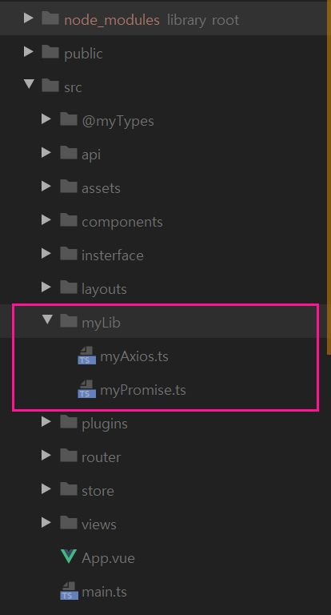
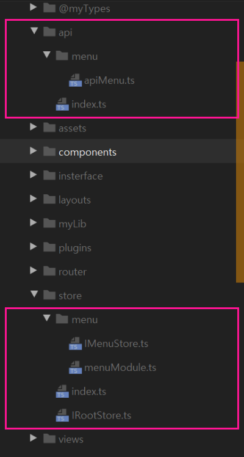
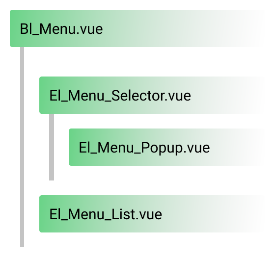
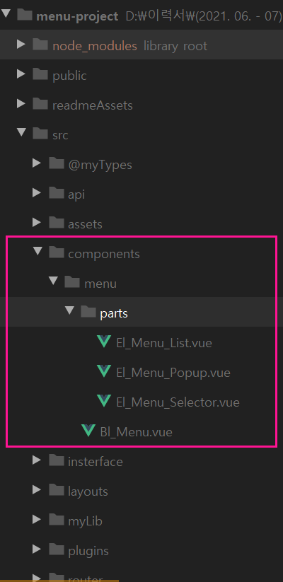
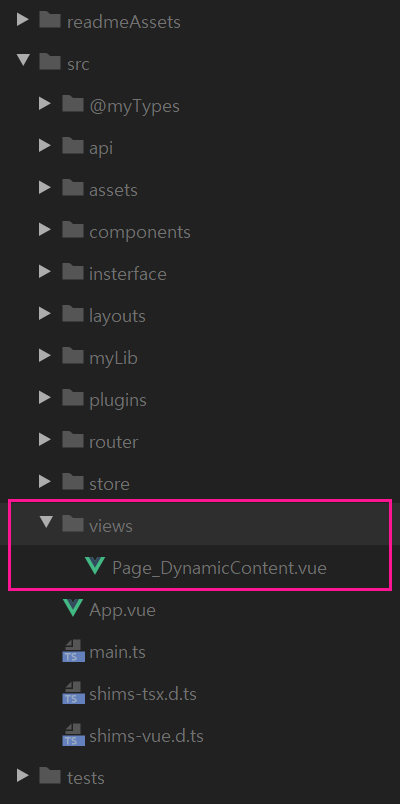

# Smart Jack 코딩 테스트

* 지원자: **김영우**
* 아래는 코딩 테스트에 대해 간단한 요약을 작성 하였습니다.
* ``npm install`` 후, ``npm run serve`` 로 실행하실 수 있습니다.

 

## 문제 3 - Vue 페이지의 구성

``문제 1 - Promise 구현`` 과 ``문제 2 - Axios등, ajax 라이브러리 구현`` 을 사용하여 ``문제 3 - Vue 페이지의 구성`` 을 작성 하였습니다.

* ``문제 1 - Promise 구현`` 경로: ``src/myLib/myPromise.ts``

* ``문제 2 - Axios등, ajax 라이브러리 구현`` 경로: ``src/myLib/myAxios.ts``

  

### Store 구현

``Menu``에 대한 처리를 담당할 ``Store Module``을 작성 하였습니다. (경로: ``src/store/menuModule.ts``)

``API 요청``은 ``actions``에서 담당하며, 실제 ``MyAxios``를 사용한 구현체는 ``src/api/menu/apiMenu.ts`` 입니다.

  

### 메뉴 컴포넌트 구현

``Menu`` 컴포넌트는 하위 컴포넌트로 분리하여 만들었습니다. (경로: ``src/components/menu/*``)

  

### 컨텐츠 컴포넌트 구현

``router params``를 사용하는 ``동적 페이지``를 작성 하였습니다.

  

이상 코딩 테스트 요약 입니다.

감사합니다.